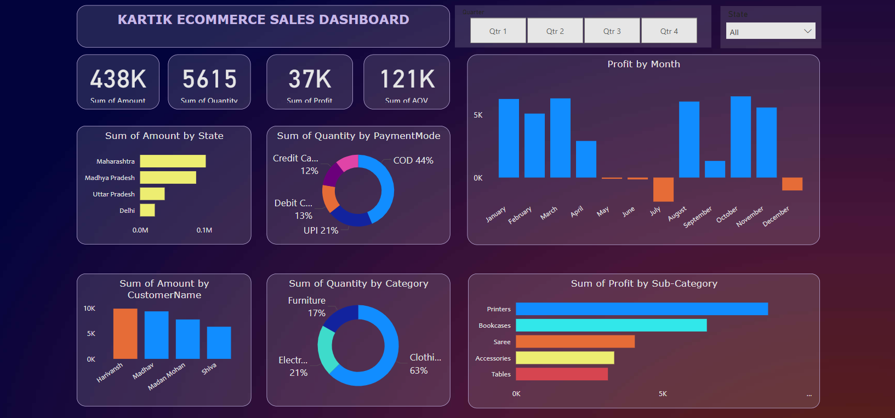

# 📊 Kartik's E-Commerce Sales Dashboard (Power BI Project)

This repository showcases an interactive and visually-rich **Power BI dashboard** created by **Kartik Yadav**. The project analyzes and visualizes e-commerce sales data across various business dimensions including time, geography, customer behavior, and product category.



---

## 🚀 Project Overview

The **Kartik Ecommerce Sales Dashboard** was designed in **Power BI Desktop** to help business users and analysts quickly gain insights into sales performance. The dashboard allows for deep-dive exploration into various metrics, trends, and customer patterns through dynamic visuals and filters.

---

## 🧠 Key Business Insights Visualized

- 📌 **Top KPIs**:
  - **Total Sales (Amount):** 438K  
  - **Total Quantity Sold:** 5615  
  - **Total Profit:** 37K  
  - **Average Order Value (AOV):** 121K  

- 📈 **Visual Elements**:
  - Bar chart for **Sales by State**
  - Donut chart for **Payment Mode Distribution**
  - Monthly bar chart for **Profit Trends**
  - Horizontal bar for **Sales by Customer**
  - Donut chart for **Category-wise Quantity**
  - Horizontal bar for **Sub-Category Profit**

- 🧩 **Interactive Filters**:
  - **Quarter Selector** (Q1 to Q4)
  - **State Filter** (Drop-down)

---

## 🛠️ Tools & Technologies Used

- 📍 **Power BI Desktop**
- 📊 **Data Transformation** using Power Query
- 🔍 **DAX (Data Analysis Expressions)** for custom measures
- 🎨 Custom styling and theme for clean, modern visuals

---

## 💡 Insights Highlighted

- **Maharashtra** had the highest order value among all states.
- **Cash on Delivery (COD)** dominated the payment modes with 44% share.
- **Clothing** was the most sold product category (63% of quantity).
- **Harivansh** was the top customer in terms of total amount spent.
- Profit saw fluctuations, with a noticeable dip in **July and August**.

---

## 📂 Project Structure
```
📁 kartik-powerbi-sales-dashboard
│
├── 📊 Screenshot_powerBI_salesDashboard.png
├── 📄 README.md
└── 📁 powerBI_Dashboard.pbix
```

> *Note: `.pbix` file and dataset are not publicly included due to privacy and size constraints. Contact Kartik for demo access.*

---

## 📚 What I Learned

- Creating layered KPI cards in Power BI
- Using slicers for advanced filtering (Quarters, State)
- Visual storytelling with custom themes
- DAX formulas for AOV, Profit, and other metrics

---

## 🙋‍♂️ About Me

I’m **Kartik Yadav**, a final-year Computer Science Engineering student passionate about **Data Analytics, Dashboarding, and Visual Storytelling**. I built this project to demonstrate my Power BI skills and help businesses understand their data better.

- 📧 **Email**: kartikyadav102003@gmail.com  
- 🔗 **LinkedIn**: [https://www.linkedin.com/in/kartik-yadav-91929a271?utm_source=share&utm_campaign=share_via&utm_content=profile&utm_medium=android_app]  
- 💼 **Portfolio**: [https://github.com/kartikydv120]

